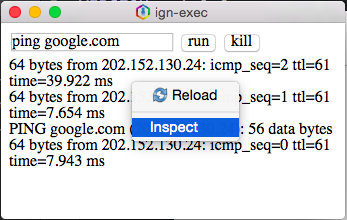

##Debugging
Saat proses development proses debugging ini memiliki peranan sangat penting untuk mengetahui proses yang dilakukan oleh aplikasi ignsdk yang sedang kita jalankan. Di IGNSDK debugging dibagi menjadi dua mode, local dubugging dan remote debugging.

###1.1 Local Debugging
Secara default local debugging IGNSDK bisa diaktifkan dengan 2 cara yaitu
* Cara 1 : menambahkan parameter -d saat menjalankan aplikasi IGNSDK
~~~
$ ignsdk -d -p ~/IGNSDK-APP/aplikasi-keren.ign
~~~
* Cara 2 : Menambahkan object `debug` dengan value `true` pada berkas `ignsdk.json`
~~~json
{
    "config" : {
    "debug" : true,
    "websecurity" : true,
    "name" : "Aplikasi Keren"
    }
}
~~~

###1.2 Remote Debugging
Remote debugging memungkinkan kita melakukan debug mode IGNSDK di browser atau device lain. Untuk mengaktifkan remote debugging cukup menambahkan parameter `-r <port>`.
~~~
$ ignsdk -d -r 8080 ~/IGNSDK-APP/aplikasi-keren.ign
~~~
Akses debugging mode lewat browser `http://ip-target:port` contoh `http://127.0.0.1:8080`
<end>
